```{r setup, include=FALSE}
knitr::opts_chunk$set(echo = TRUE)
```

This document includes screenshots of my preferred RStudio configuration. It heavily relies on this [post](https://drdoane.com/my-rstudio-configuration/) by William Diane.


## General

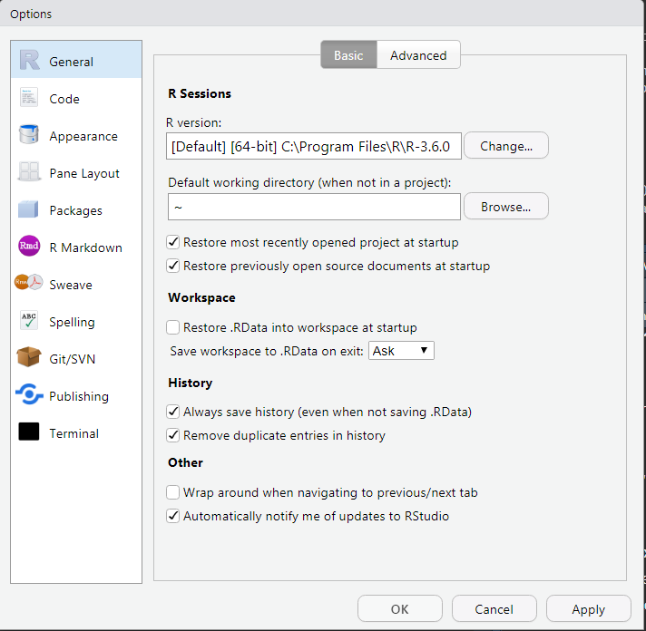
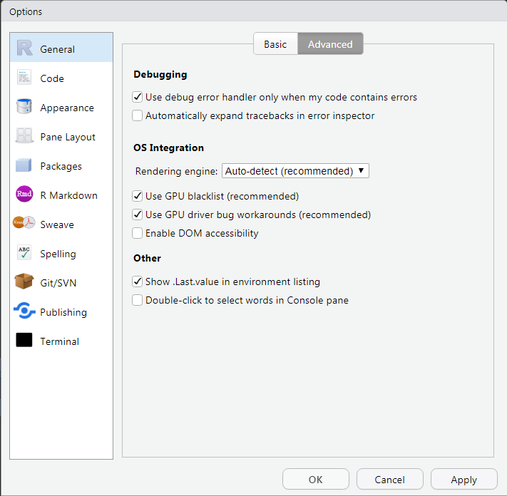

## Code

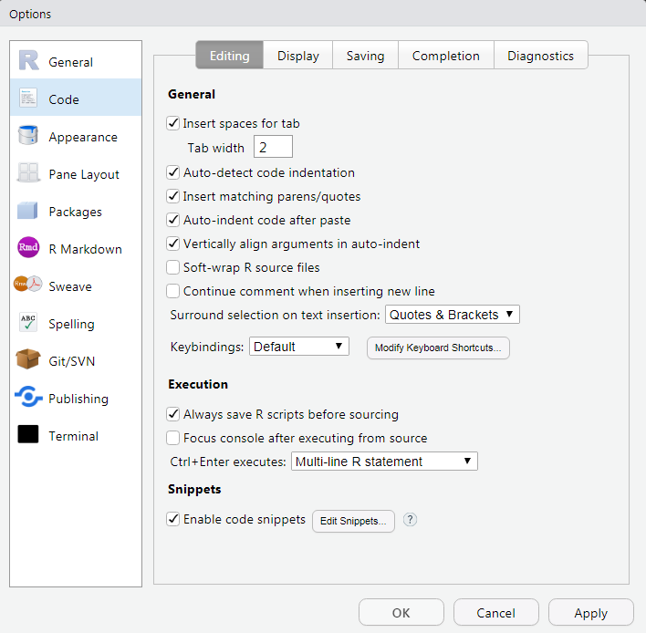
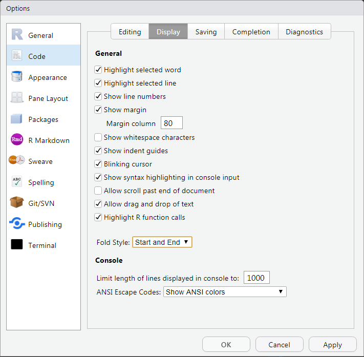
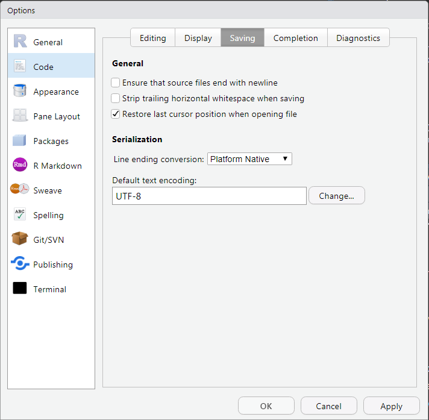

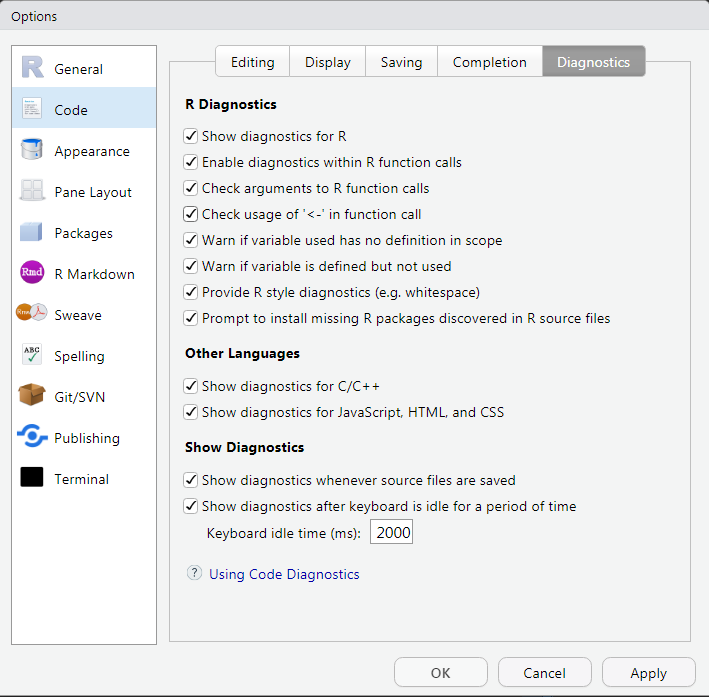


## Appearance
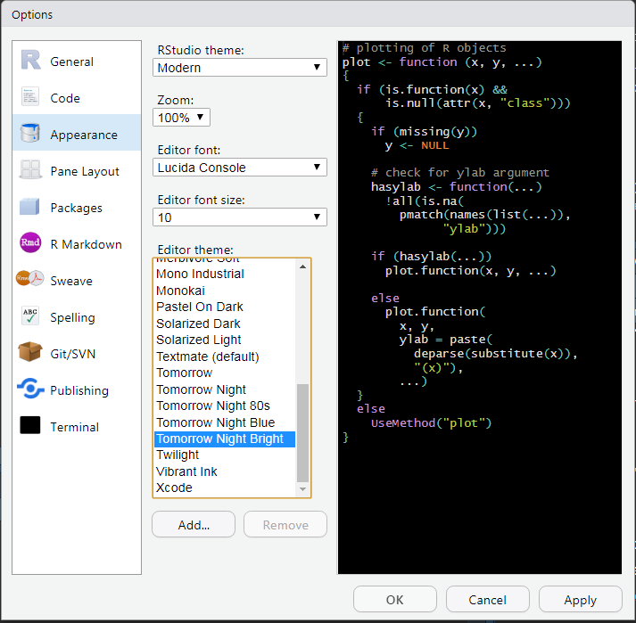

## Pane Layout
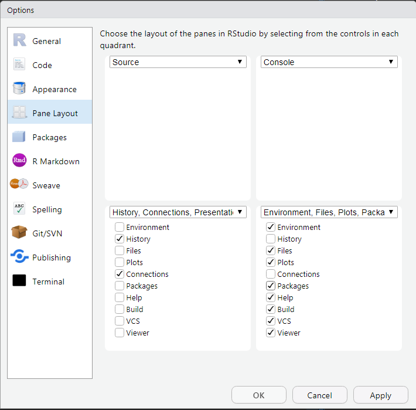


## Packages
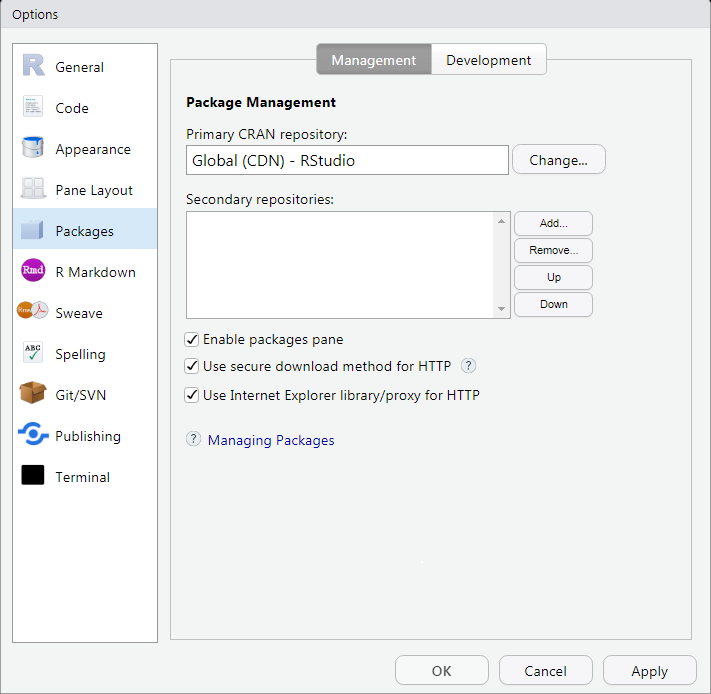
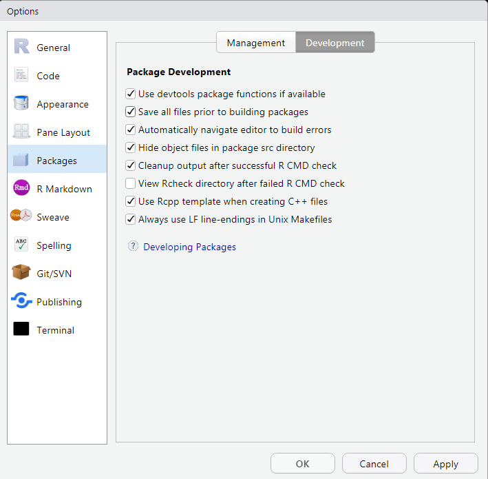

## R Markdown
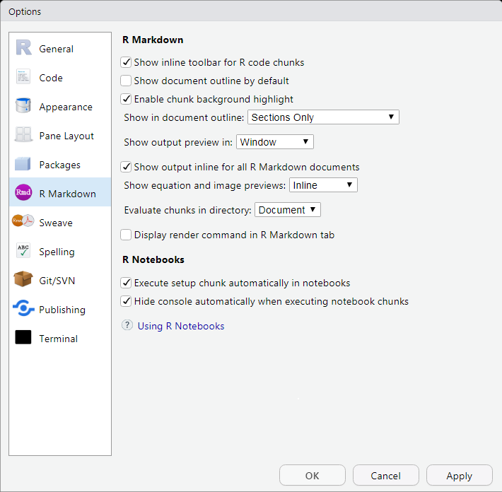

## Sweave
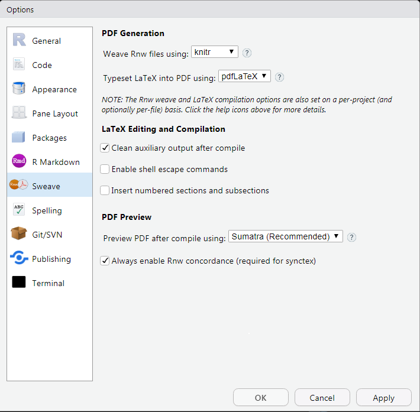

## Spelling
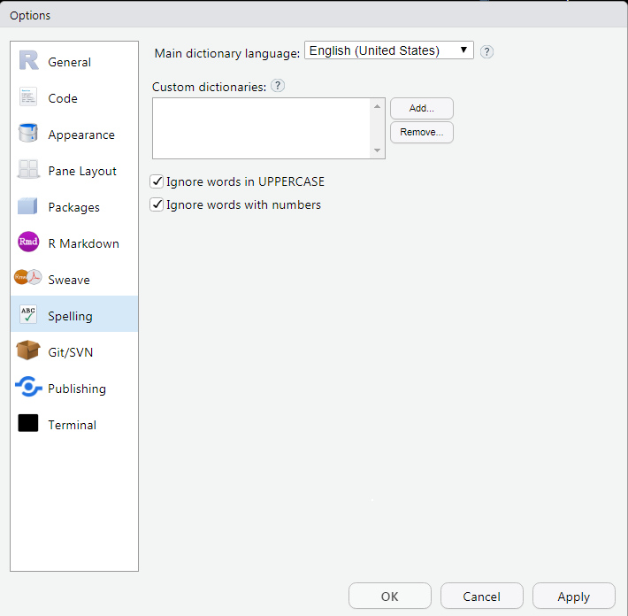


## Git/SNV
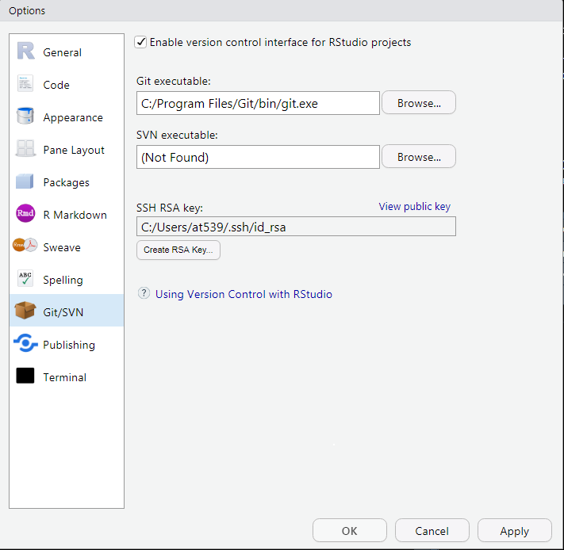


## Publishing
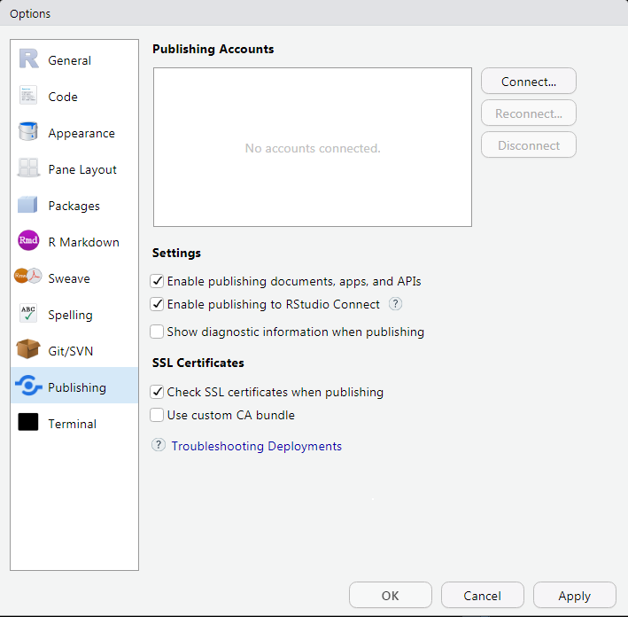

## Terminal
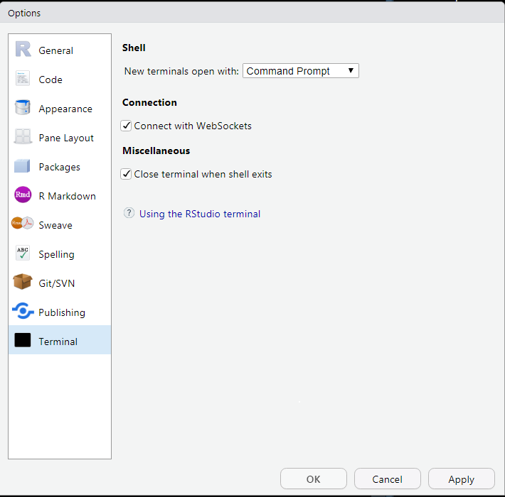
