```{r setup, include=FALSE}
knitr::opts_chunk$set(echo = TRUE)
```

Screenshots of my preferred RStudio configuration. 

## General
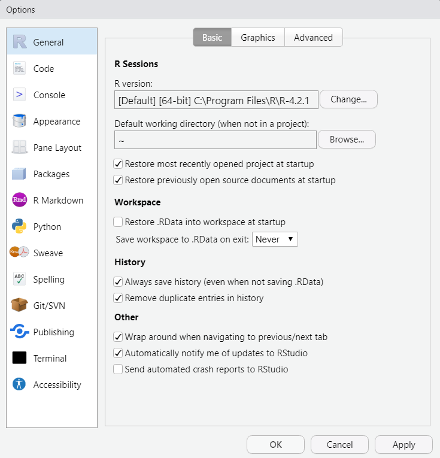

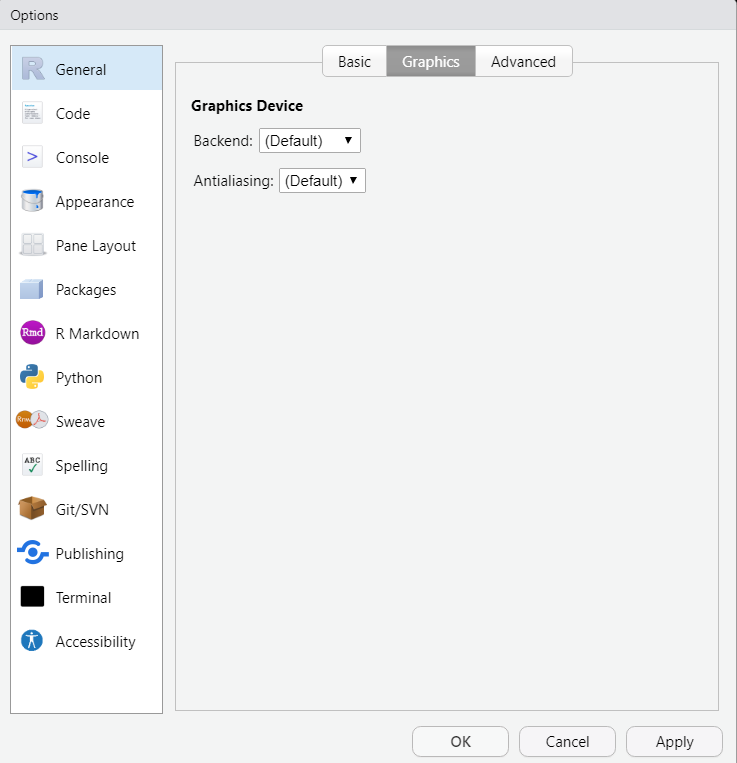


## Code
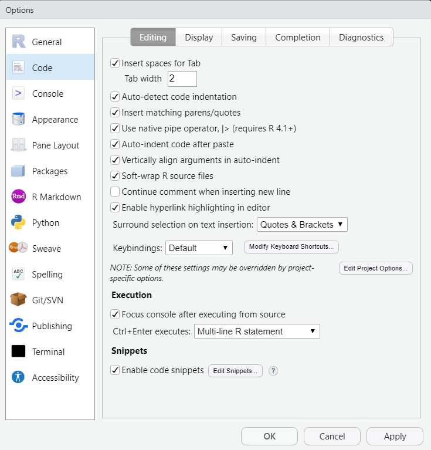
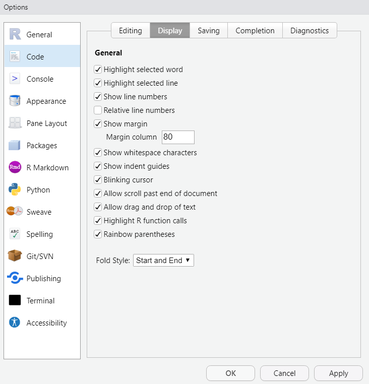

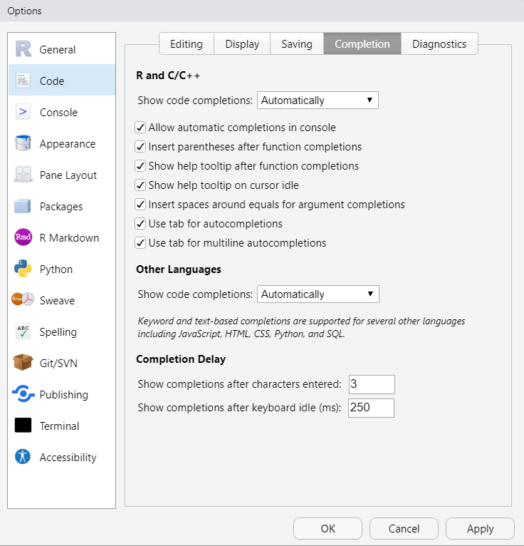


## Appearance
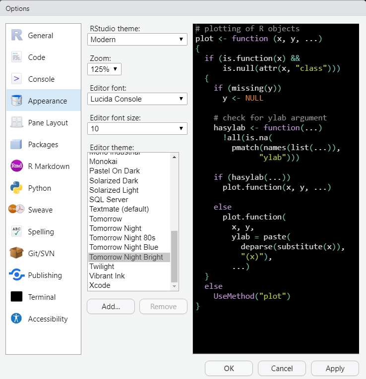


## Pane Layout
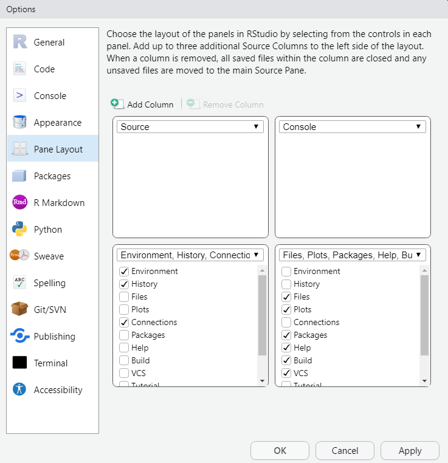


## Packages
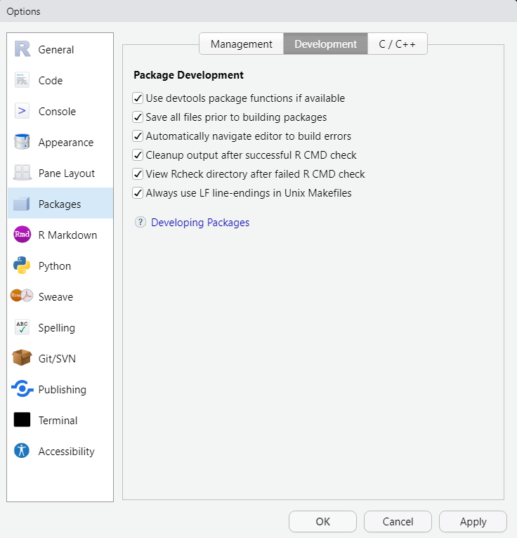


## R Markdown


## Sweave
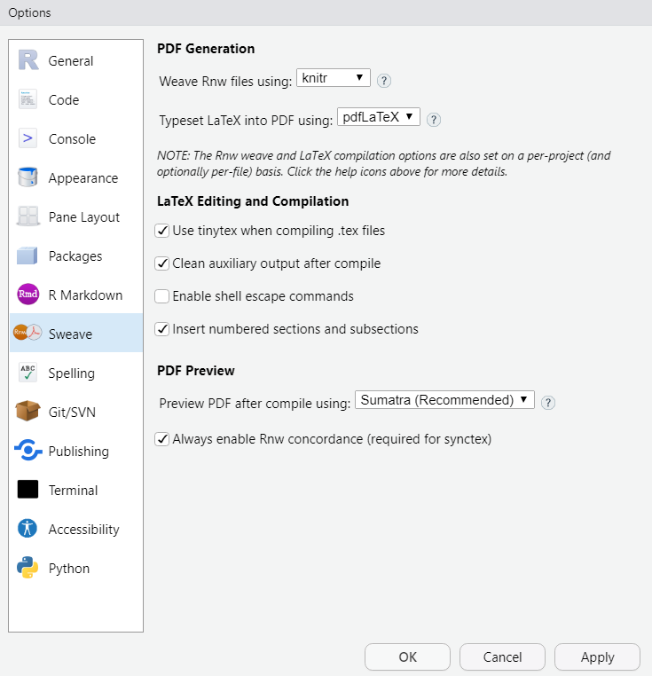


## Spelling
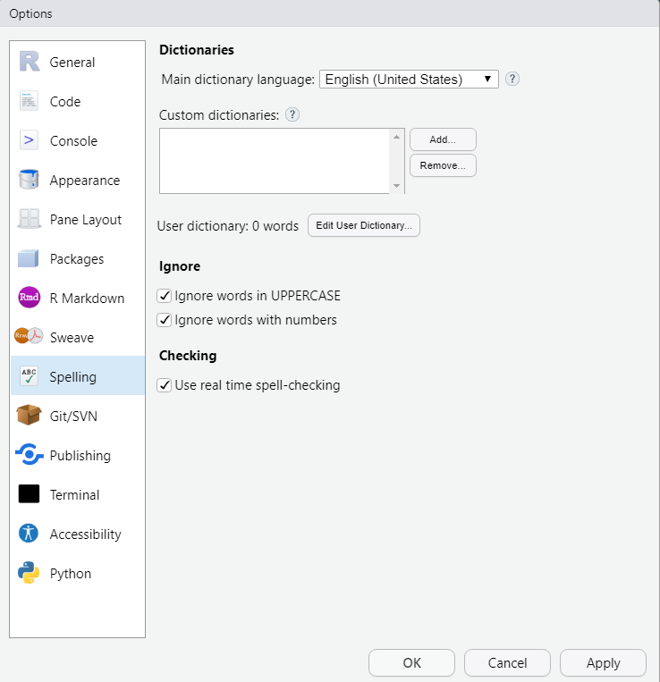


## Git/SNV


## Publishing
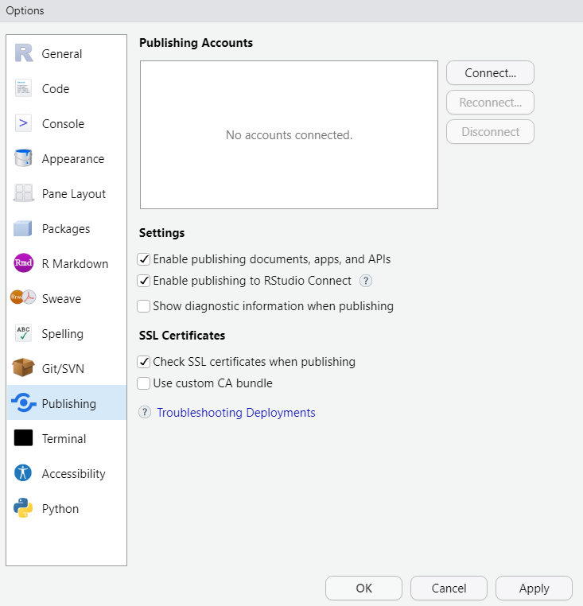


## Terminal


## Accessibility

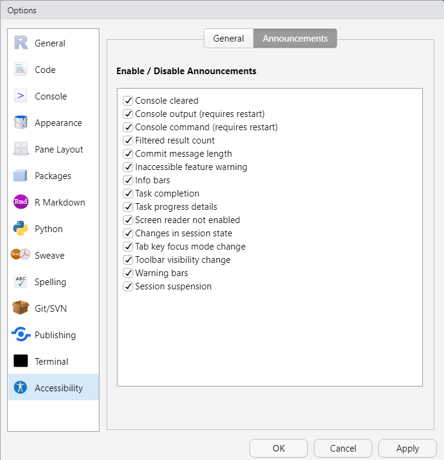


## Python


## Sources

- Document relies on this [post](https://drdoane.com/my-rstudio-configuration/) by William Diane. 
- Details about the different options can be found [here](https://support.rstudio.com/hc/en-us/articles/200549016-Customizing-RStudio).

